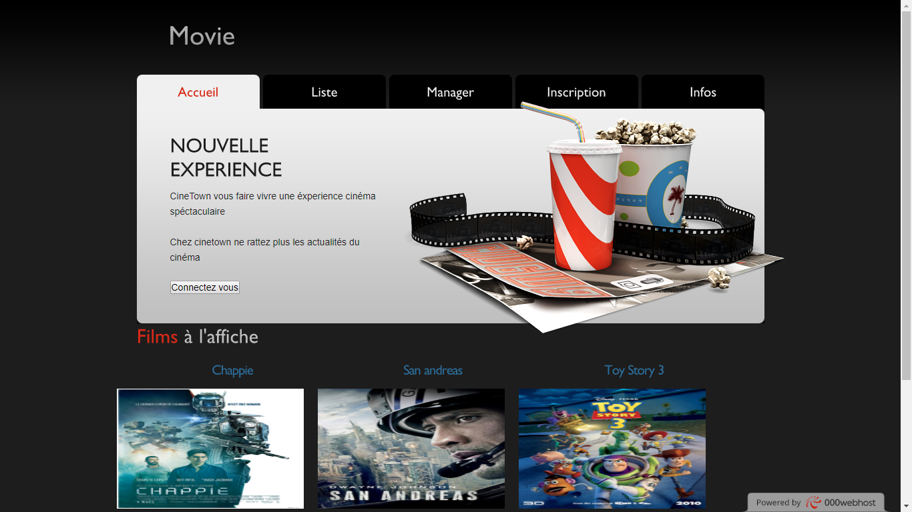
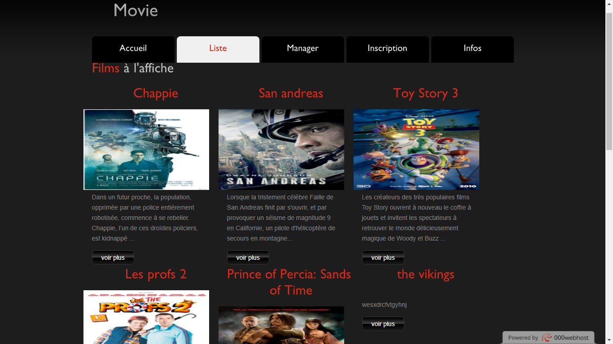
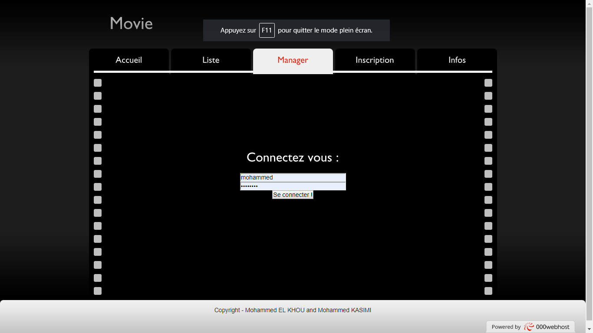
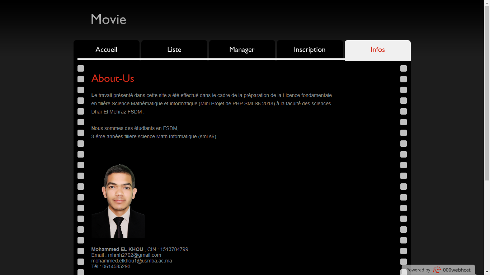

# MovieM
the primary purpose of movie websites. Obviously, in order for a movie to be financially successful, it needs to do well at the box office, and today many moviegoers use the Internet to find movies to see and to buy tickets. Having things like trailers and other video clips helps to engage visitors and encourages them to find show times and buy tickets online. 

Our goal in the sequel is to create a part of a PHP web application to publish a set of movie articles on the web. We are mainly interested in developing the backend of the application, that is to say, the part entrusted to the administrators. In particular, we want to allow users to log in to the application with logins and passwords to add new articles and modify or delete existing articles. 
  
admin on the site:
* login : mohammed        
* password : mohammed  

le lien :
	https://moviem.000webhostapp.com/

***
### Links
- [E-mail : ](mailto:m.elkhou@hotmail.com) m.elkhou@hotmail.com
- [Linkedin](https://www.linkedin.com/in/m-elkhou/)
- [GitHub](https://github.com/m-elkhou)
